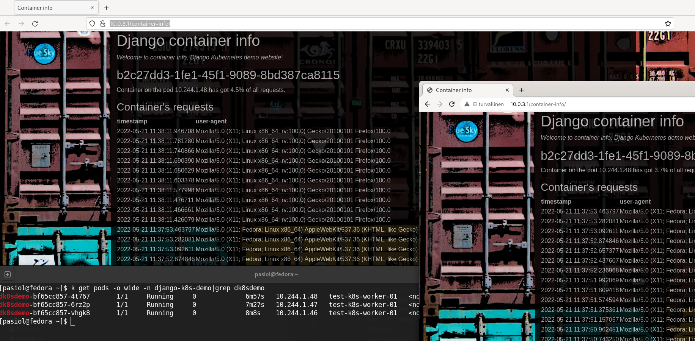

# Django Kubernetes Demo

The app is a simple Django app that calculates the percentage of requests per container.

The info module creates a UUID for the starting container. /container-info endpoint displays the requests and percentage of total requests received by the container.

## docker-compose enviroment for debugging

    git clone https://github.com/pasiol/Django-k8s-demo.git
    cd Django-k8s-demo/
    docker-compose build && docker-compose up -d
    docker-compose run web python manage.py migrate --noinput
    firefox http://127.0.0.1 &

Stopping docker-compose app.

    docker-compose down

## deployment on the local k8s dev environment

Below are instructions how to run a cluster using the Linux KVM (Kernel-based virtual machines) hypervisor.

The application should work in other k8s environments as well. The DJANGO_ALLOWED_HOST variable has to be compatible with the load balancer config. Load balancer/service objects have to be defined as compatible with the Kubernetes engine.

### provisioning vms on KVM

With terraform, you can create the virtual machines needed by the Kubernetes cluster.

https://github.com/pasiol/tf-k8s-test-cluster

### configure master and worker nodes

The next repo includes Ansible playbooks to configure for master and worker nodes.

https://github.com/pasiol/k8s-pre-bootstrap

### setting up k8s

The cluster starts with the kubeadm command.

https://kubernetes.io/docs/setup/production-environment/tools/kubeadm/create-cluster-kubeadm/

    kubeadm init --pod-network-cidr=10.244.0.0/16 # master node initialization using Flannel network
    kubeadm token create --print-join-command # getting join command for workers

### setting up app

The easiest way to install the application is with the customize command. The required specifications are under the manifests folder.

    kustomize build manifests/overlays/development/ | kubectl apply -f -
    firefox http://10.0.3.1 &

## Links

Installing kustomize

- https://kubectl.docs.kubernetes.io/installation/kustomize/source/
