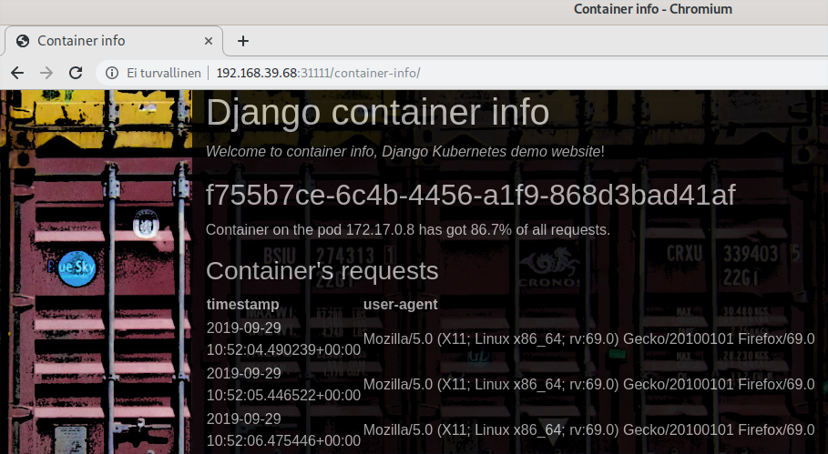

# Django Kubernetes Demo

A simple Django app which calculates the percentage of requests per container.

The info module creates the UUID for the starting container. /container-info endpoint displays the requests and percentage of total requests received by the container.

## docker-compose enviroment for debugging

    git clone https://github.com/pasiol/Django-k8s-demo.git
    cd Django-k8s-demo/
    docker-compose build && docker-compose up -d
    docker-compose run web python manage.py migrate --noinput
    firefox http://127.0.0.1 &

Stopping docker-compose

    docker-compose down

## deployment on the local k8s dev environment

    kustomize build manifests/overlays/development/ | kubectl apply -f -

## Links

Installing kustomize

- https://kubectl.docs.kubernetes.io/installation/kustomize/source/
